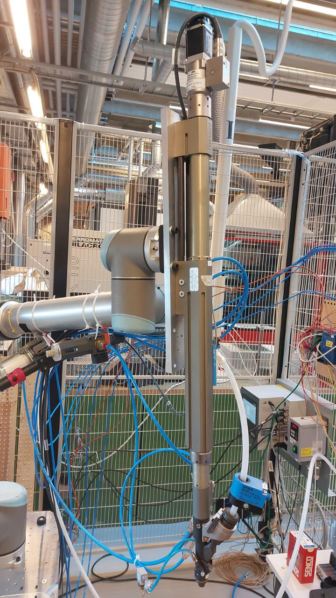
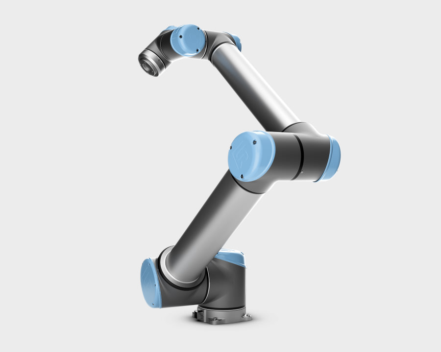
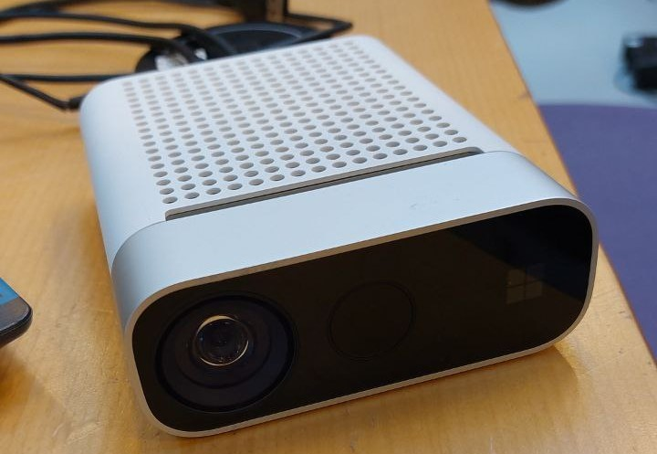

# ScrewingCell

Repository for Master's degree project made on Aalborg University called:

*"Time-Series Anomaly Detection for
Industrial Screwdriving Task with Machine
Learning Algorithms"*

This repository shows the code used on the project regarding the data collection, data processing, machine learning and deep learning.

## Table of Contents
1. [Dataset](#dataset)
   - [Intrinsic data](#intrinsic-data)
   - [Task data](#task-data)
   - [Extrinsic data](#extrinsic-data)
2. [Data collection](#data-collection)
   - [Data collection (main)](#data-collection-main)
   - [Data sorting](#data-sorting)
3. [Data processing](#data-processing)
   - [Task data preprocessing](#task-data-preprocessing)
   - [Noise reduction](#noise-reduction)
   - [ML/DL processing](#ML/DL-processing)
4. [Machine/Deep learning](#Machine/Deep-learning)
   - [Preprocessing for ML/DL](#preprocessing)
   - [Feature extraction](#Feature-extraction)
   - [ML/DL processing](#ML/DL-processing)

## Dataset
The full dataset collected can be found on the following Google Drive:

[Dataset download](https://drive.google.com/file/d/1yo6eICPlD_ZEKKhkYUrDPdh4wYatlIMv/view?usp=drive_link)

The information regarding the dataset structure and the dataset can be found inside of the Dataset.zip which can be downloaded with the link provided. The dataset contains the following data sources:

### Intrinsic data
Intrinsic data source provides the data from the sensors mounted on the automatic screwdriver. The sensors measure the screwdriving torque, angle, depth, current and RPM.

### Task data
Task data source provides the data from the Universal Robots UR10 robot. The data contains 6 Tool Centerpoint Position measurements, together with the current provided to the robot.

### Extrinsic data
Extrinsic data source provides the audio recording of the screwdriving process in .wav format.

## Data collection
The following code is provided for data collection:

### Data collection (main)
This code is the main code for connection with the robot and microphone. This script connects to the PLC, reads the registers containing the UR10 robot information, connects to the Azure Kinect DK microphone and uses a strobe signal implemented in the PLC, to start and stop data recording from different data sources. The results are saved as CSV and WAW files for every screw.

### Data sorting

This scripts are the main codes for sorting and storing the files after the srewdriving. They include conversion of the intrinsic data from the screwdriver controller from KXML format to CSV format, and provide a labeling system for all files.

## Data processing
The following code is provided for data processing:

### Task data preprocessing
This is the code that was used for processing of the data from the UR10 robot.

### Noise reduction

This code uses a low-pass filter to remove the noise from the audio files, which is based on the audio recordings of the background noise in different instancess during the screwdriving process.

### ML/DL processing

The processing of data for machine and deep learning is done by the code provided in Machine Learning and Deep Learning folders. This included all of the processed related to the formating and labeling of the data, data normalisation and cleaning.

## Machine/Deep learning
The following code is provided for machine/deep learning:

### Preprocessing for ML/DL
This is the code that was used for processing of the data from the UR10 robot.

### Noise reduction

This code uses a low-pass filter to remove the noise from the audio files, which is based on the audio recordings of the background noise in different instancess during the screwdriving process.

### ML/DL processing

The processing of data for machine and deep learning is done by the code provided in Machine Learning and Deep Learning folders. This included all of the processed related to the formating and labeling of the data, data normalisation and cleaning.

